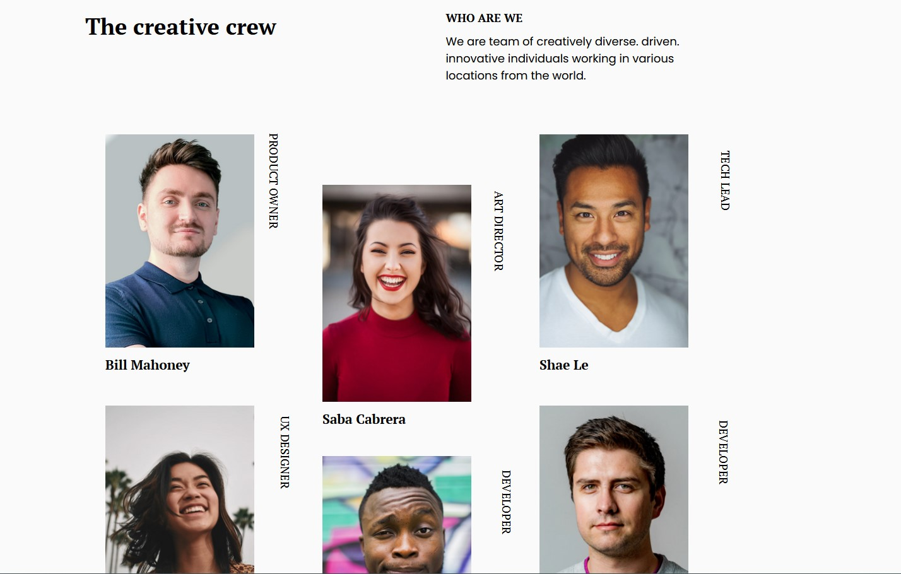
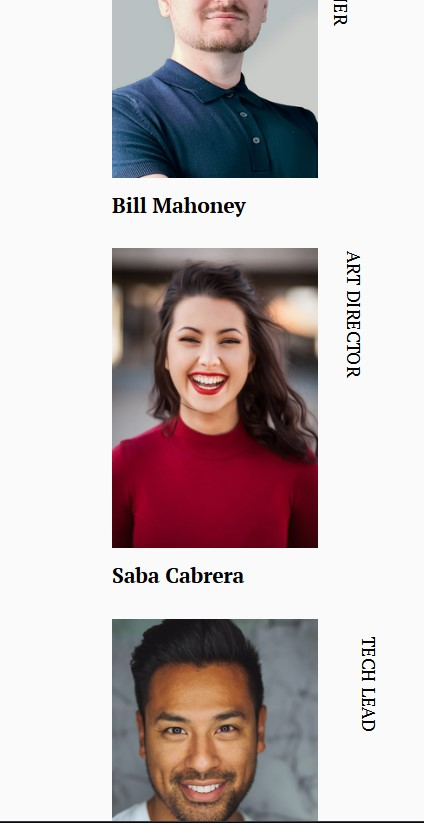

<!-- Please update value in the {}  -->

<h1 align="center">My Team</h1>

<div align="center">
   Solution for a challenge from  <a href="http://devchallenges.io" target="_blank">Devchallenges.io</a>.
</div>

<div align="center">
  <h3>
    <a href="#">
      Demo
    </a>
    <span> | </span>
    <a href="https://github.com/issagoodlifeInc/MyTeam.git">
      Solution
    </a>
    <span> | </span>
    <a href="https://devchallenges.io/challenges/hhmesazsqgKXrTkYkt0U">
      Challenge
    </a>
  </h3>
</div>

<!-- TABLE OF CONTENTS -->

## Table of Contents

- [Table of Contents](#table-of-contents)
- [Overview](#overview)
  - [Built With](#built-with)
- [Features](#features)
- [Acknowledgements](#acknowledgements)
- [Contact](#contact)

<!-- OVERVIEW -->

## Overview


- Laptop layout of MY Team



- Mobile layout of MY Team

Introduce your projects by taking a screenshot or a gif. Try to tell visitors a story about your project by answering:

- Would have liked to structure my CSS better on this + a better turnaround time never hurt

### Built With

<!-- This section should list any major frameworks that you built your project 
using. Here are a few examples.-->

- Semantic HTML + CSS [ Grid]

- Used grid to style both the heading and main sections of the team
- Used the `nth:child()` pseudo selector to bring out the Y transformation of certain elements of the team
- 
```css
@media only screen and (width > 600px) {
  header {
    display: grid;
    grid-template-columns: 2fr 1.5fr;
  }
}
@media only screen and (width < 850px) {
  .da__crew {
    gap: 1rem;
    grid-template-columns: repeat(auto-fit, minmax(min(100%, 250px), 1fr));
  }
  .crew {
    max-width: 270px;
  }
  .crew:nth-child(3n-1) {
    transform: translateY(0%);
  }
  .crew:nth-child(even) {
    transform: translateY(20%);
  }
}

```


## Features

<!-- List the features of your application or follow the template. Don't share the figma file here :) -->

This application/site was created as a submission to a [DevChallenges](https://devchallenges.io/challenges) challenge. The [challenge](https://devchallenges.io/challenges/hhmesazsqgKXrTkYkt0U) was to build an application to complete the given user stories.


## Acknowledgements

<!-- This section should list any articles or add-ons/plugins that helps you to complete the project. This is optional but it will help you in the future. For exmpale -->

- [Smol Responsive CSS Grid by Stephanie Eckles](https://smolcss.dev/)
- Twitter [Stephanie Eckles](https://twitter.com/5t3ph)

## Contact

- Website [Lesley Kimutai](https://leskimfamily.herokuapp.com/lesley)
- GitHub [@Leskim](https://github.com/Leskim)
- Twitter [@LesleyKimutai](https://twitter.com/LesleyKimutai)
